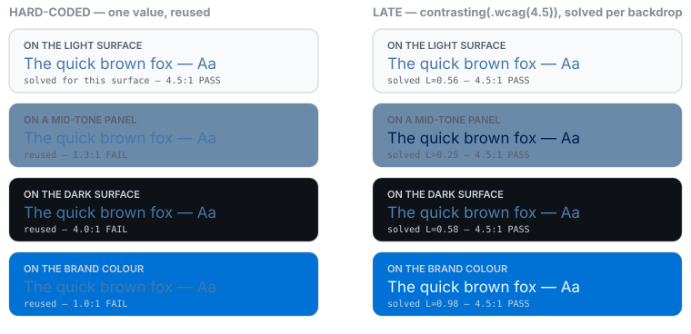
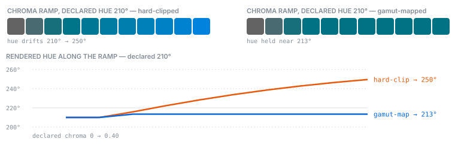

# oklch-swiftui

OKLCH colours for SwiftUI that **resolve late** — against the real display gamut, colour scheme, contrast setting, and ambient background, at the moment SwiftUI asks for a colour rather than when you wrote it down.

```swift
Rectangle().fill(
    OklchStyle(Oklch(lightness: 0.55, chroma: 0.12, hue: 250))
        .dark(Oklch(lightness: 0.85, chroma: 0.06, hue: 250))
)
```

Light mode resolves the base colour, dark mode the variant. Neither is converted to RGB until `resolve(in:)` is called — so the conversion can account for whether the display is sRGB or Display P3, and whether the user has "Increase Contrast" on.

## Why this exists

Roughly twenty Swift packages already expose OKLCH. None of them read `colorSchemeContrast`. Every one of them converts to RGB **eagerly**, at construction time:

```swift
import ChromaKit

// Convert from OKLCH now, keep only the RGB.
let eager = Color.oklch(0.55, 0.18, 250)
```

The destination gamut, the colour scheme, the contrast setting, and the backdrop are all runtime facts. Converting back is possible — the maths is invertible — but one baked value cannot say what its author would have chosen for dark mode, Increase Contrast, or a display that could have shown more chroma.

### The solution: keep the colours in OKLCH until the moment they are needed

SwiftUI has exposed `ShapeStyle.resolve(in: EnvironmentValues)` since iOS 17. Nothing in the ecosystem currently uses it to make colour decisions — that is the whole idea here.

An `OklchStyle` is a set of OKLCH variants, not a colour. `light` is required; `.dark(_:)` and `.increasedContrast(light:dark:)` fill the other three slots, and nothing is chosen at construction. When SwiftUI calls `resolve(in:)`, the style reads `colorScheme` and `colorSchemeContrast`, picks the matching variant (missing slots fall back toward `light`), and gamut-maps it to the display gamut the environment reports.

Variants can be authored like this:
```swift
// All four variants declared, none converted from OKLCH yet.
let late = OklchStyle(
        Oklch(lightness: 0.55, chroma: 0.18, hue: 250)
    )
    .dark(Oklch(lightness: 0.85, chroma: 0.06, hue: 250))
    .increasedContrast(
        light: Oklch(lightness: 0.38, chroma: 0.09, hue: 250),
        dark: Oklch(lightness: 0.95, chroma: 0.02, hue: 250)
    )
```

If you want a colour computed for you, `contrasting(_:hue:chroma:preferring:against:)` solves one against the actual backdrop instead:

```swift
// Declare intent instead of values. This solves against whatever 
// backdrop is actually behind it — including ones you never saw.
let readable = OklchStyle.contrasting(.wcag(4.5), hue: 250, chroma: 0.1)
```

**Contrast, solved where the backdrop is known.** Left: the best a hard-coded value can be — solved once, for the light surface — reused across four backdrops, collapsing to 1.0:1 on the brand colour. Right: the `contrasting` declaration above, solved per backdrop: 4.5:1 on all four. A build step could pre-solve these, but not a backdrop that a reusable component meets at composition time.



**Gamut, mapped instead of clipped.** The ramps below hold one declared hue while chroma rises. Past C≈0.09 this colour is a purer cyan-blue than any mix of sRGB's green and blue primaries — matching it would need negative red light, which no display has. Something must give. Hard-clipping (left) snaps red to 0 and lets green and blue keep growing, lightening the colour and bending its hue from 210° toward 250°. CSS Color 4's gamut-mapping algorithm (right) walks chroma back instead, holding the hue and lightness that make the colour recognisable — any residual error stays below a just-noticeable difference.



<!-- verified-by: testReadmeWhyThisExistsTable -->
<!-- verified-by: testReadmeComparisonSvgsMatchPipeline -->

## Install

```swift
// Package.swift
dependencies: [
    .package(url: "https://github.com/soren-creates/oklch-swiftui.git", from: "0.1.0")
]
```

Then add `OklchUI` (SwiftUI) or `OklchCore` (pure maths, no platform dependencies) to your target.

**Requirements:** iOS 17 · macOS 14 · tvOS 17 · visionOS 1 · watchOS 10 (`OklchCore` only). `resolve(in:)` is the hinge of the design and does not exist earlier than these versions. `OklchCore` also builds and tests on Linux.

## Usage

### Text that meets a contrast target

```swift
VStack { Text("Readable") }
    .foregroundStyle(OklchStyle.contrasting(.wcag(4.5), hue: 250, chroma: 0.1))
    .oklchBackground(OklchStyle(Oklch(lightness: 0.95, chroma: 0.02, hue: 90)))
```

`oklchBackground` draws the background **and** publishes it, so `.contrasting` solves against the colour actually on screen rather than one you have to remember to keep in sync.

Targets can be `.wcag(ratio)` or `.apca(Lc)`. Two more knobs when the defaults don't fit:
`preferring:` fixes which side of the backdrop the solve searches (`.automatic` takes whichever
has more headroom), and `against: .explicit(…)` solves against a colour you name — say, a brand
fill that is not published to the environment:

```swift
OklchStyle.contrasting(
    .apca(75), hue: 250, chroma: 0.1,
    preferring: .lighter,
    against: .explicit(Oklch(lightness: 0.55, chroma: 0.18, hue: 250))
)
```

### When a target cannot be met

APCA Lc 120 against mid-grey has no solution at any lightness. Rather than crash or silently miss, the solve returns the best achievable colour and reports the shortfall:

```swift
.oklchDiagnostics { resolution in
    print("wanted \(resolution.requested), got \(resolution.achieved)")
}
```

Renders never break on an unreachable target; contrast regressions are still catchable in CI
([ADR-0006](docs/adr/0006-report-unreachable-targets-rather-than-throw.md)).

### Overriding the detected gamut

```swift
.colorGamut(.sRGB)   // e.g. an external sRGB display, or a deterministic test
```

The default is detected once from the platform trait. Overriding matters when a P3 Mac is driving an sRGB display, where auto-detection alone hands back colours the screen cannot show.

### Resolving by hand

SwiftUI calls `resolve(in:)` itself wherever a `ShapeStyle` is used — you never have to. But it is an ordinary pure function of the environment, which makes styles easy to test:

```swift
let style = OklchStyle(Oklch(lightness: 0.55, chroma: 0.12, hue: 250))
    .dark(Oklch(lightness: 0.85, chroma: 0.06, hue: 250))

var environment = EnvironmentValues()
environment.colorScheme = .dark
environment.colorGamut = .displayP3

let resolved: Color = style.resolve(in: environment)   // the dark variant, P3-tagged
```

(`colorSchemeContrast` has no setter — only the OS can vary it, which is why the characterization tests toggle the real system setting instead.)

## What it does

`OklchCore` — pure value types, importing no `SwiftUI`, `UIKit`, `CoreGraphics`, or even
`Foundation`:

- `Oklch`, and `Gamut` for sRGB + Display P3
- CSS Color 4 [§14.2.2](https://www.w3.org/TR/css-color-4/#binsearch) gamut mapping (binary chroma search with a ΔE_OK JND guard), plus per-channel clip for shader parity
- `maxChroma`, and interpolation with shortest-arc and powerless-hue rules
- APCA and WCAG contrast measurement, and a lightness-bisecting contrast solver with observable shortfall

`OklchUI` — the SwiftUI layer:

- `OklchStyle`, a `ShapeStyle` that stays in OKLCH: light/dark/increased-contrast variants, or a `.contrasting` target solved lazily against the ambient backdrop
- `oklchBackground(_:)`, which draws and publishes in one call
- `\.colorGamut`, `\.themeBackground`, `\.oklchDiagnostics`

`OklchCore` never depends on `OklchUI`. The Linux build and `check.sh`'s API-surface diff both enforce that rather than trusting convention.

## Not in scope

JSON theming · ramps and palettes · gradients (iOS 18's `Gradient.colorSpace(.perceptual)` covers the common case) · image extraction · CIELab/LCh · CAM16/HCT · Rec.2020 · Helmholtz–Kohlrausch correction.

This is deliberately a thin package. Scope creep toward a design system is why the existing ones are large and still miss the gap.

## Testing

Five tiers, and the point of the first one is that **nothing here validates itself**:

| Tier                 | What it does                                                                                                                               |
| -------------------- | ------------------------------------------------------------------------------------------------------------------------------------------ |
| 1 — fixtures         | Conversion and gamut-map agreement against a generated [Color.js](https://colorjs.io) oracle, plus fixture-integrity checks                |
| 2 — property         | Round-trip identity, gamut-map idempotence, hue/lightness survival under chroma reduction; pinned RNG seed                                 |
| 3 — regression       | One test per defect found in a shipping package during the survey (`B1`–`B5`)                                                              |
| 4 — contrast         | `achieved >= requested` across a grid; automatic-direction and unreachable-target behaviour                                                |
| 5 — characterization | That `resolve(in:)` output actually changes with `colorScheme`, `colorGamut`, and `colorSchemeContrast` — hosted through a real `UIWindow` |

The fixture generator **asserts its own intent before writing and stops on disagreement**, so it cannot degenerate into "whatever Color.js says is correct". 

Every tolerance in the codebase is a **pin** with a recorded measurement behind it ([`docs/pins.md`](docs/pins.md)), and every test names the pin it rests on. Pins move only on new evidence.

### Running everything

```bash
./check.sh          # the all-green gate: fixtures → build → tests → DocC → API surface
swift test          # core + UI tests (6 UI tests skip without a hosted UIWindow)
```

`./check.sh` regenerates the fixtures and asserts they are byte-identical, runs both suites on the host and in the simulator, runs a two-pass Increase Contrast probe against the real system setting, builds DocC with `--warnings-as-errors`, and diffs the public API surface against recorded baselines.

There is one **optional** step that needs a physical device and never gates anything — see below.

## On-device evidence, and its limits

`Tools/DeviceHarness/` renders known out-of-sRGB swatches on a real device, reads its own pixels back, and writes the measured values to a file. No human transcribes or eyeballs a colour value.

**What it establishes.** P3 survives the framework's colour math un-clamped on device — a red channel measuring `-0.2247314453125`, negative and therefore unreachable in sRGB. `OklchStyle`'s own resolution path preserves it too, not just a raw `Color(.displayP3,…)` literal.

**What it does not establish.** That P3 reaches a physical panel. `ImageRenderer` rasterises in-process through deterministic CoreGraphics maths and never touches the window server or compositor — on device no more than in the Simulator. Device/Simulator bit-for-bit identity is the *expected* result of this measurement, not proof that a wide-gamut display was involved. Proving that needs a framebuffer screenshot or an external colorimeter.

Full scoping:
[`docs/evidence/2026-07-26-ondevice-p3-findings.md`](docs/evidence/2026-07-26-ondevice-p3-findings.md).

To re-capture it yourself you need Apple hardware attached, plus:

```bash
export OKLCH_DEVICE_UDID=...           # xcrun devicectl list devices
export OKLCH_DEVELOPMENT_TEAM=...      # see docs/survey.md for how to read the RIGHT one
./check.sh                             # verifies committed evidence; never overwrites it
```

That step **verifies** rather than mutates: it captures into a scratch path and diffs.

## Documentation

| Document                                       | What is in it                                                                                   |
| ---------------------------------------------- | ----------------------------------------------------------------------------------------------- |
| [`docs/ARCHITECTURE.md`](docs/ARCHITECTURE.md) | How the package is built and why, section by section                                            |
| [`docs/adr/`](docs/adr/)                       | Decision records: what was chosen, what was rejected, what would justify revisiting             |
| [`docs/survey.md`](docs/survey.md)             | The twenty-plus packages read, the five defects found, and this package's own known limitations |
| [`docs/pins.md`](docs/pins.md)                 | Every tolerance and behavioural constant, with the measurement that set it                      |
| [`docs/evidence/`](docs/evidence/)             | Raw probe and on-device measurements                                                            |

DocC ships in `Sources/OklchUI/OklchUI.docc`; its value-bearing claims are backed by named tests (the scope and limits of that check are in `docs/survey.md`).

## Contributing

Run `./check.sh` before opening a PR; it should end in `ALL GREEN`. If you change a tolerance, the pin in `docs/pins.md` needs the measurement that justifies it — a relaxed tolerance with no recorded evidence will be sent back. If you add a public symbol, `check.sh` step 6 fails until you refresh `docs/api-baseline/`, which is deliberate: an API change should be a visible diff.

## Licence

MIT — see [LICENSE](LICENSE).

Ottosson's OKLab matrices and the CSS Color 4 gamut-mapping algorithm are implemented from their published specifications, with attribution in-file. No code has been copied from any surveyed package.